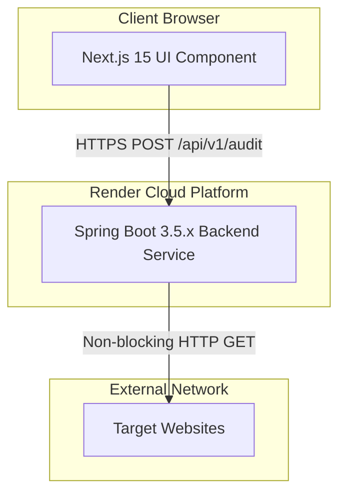
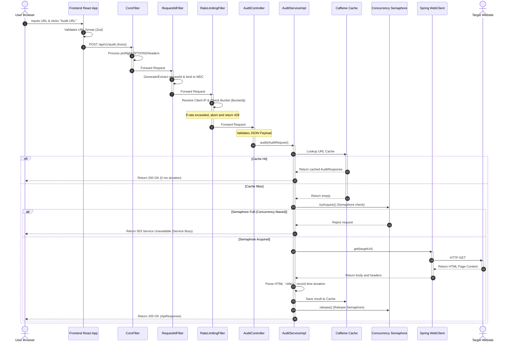

# Architectural Design

This document provides a detailed overview of the system architecture, component design, and end-to-end request flow of the Digital Heroes URL Audit application.

---

## 1. High-Level Architecture Overview

The system follows a classic **Client-Server Architecture** split into a decoupled frontend and backend. Both services run as independent web services connected over standard HTTP/2 (TLS) endpoints:

* **Frontend**: Next.js 15 (App Router) Single-Page Application (SPA) providing an interactive user interface.
* **Backend**: Spring Boot 3.5.x REST API orchestrating rate limiting, concurrency bounds, caching, and external audits.
* **External Layer**: Third-party target websites fetched dynamically on-demand during audit runs.



---

## 2. Component Responsibilities

### Frontend Component Layer
* **`Header.tsx` / `Footer.tsx`**: Renders branding elements and hyperlinks to external digital training assets.
* **`AuditForm.tsx`**: React Hook Form component integrating Zod schemas to validate URL syntax before submission.
* **`ResultCard.tsx` / `ErrorCard.tsx`**: Presentational components rendering either successful audit metrics (status, title, duration) or friendly error states.
* **`useAudit.ts`**: Custom React hook managing loading, response caching visual feedback, and error state transitions.
* **`auditService.ts`**: Axios client service communicating with `/api/v1/audit`, prepending protocol prefixes, and handling network exceptions.

### Backend Component Layer
* **`AuditController.java`**: Spring MVC RestController exposing `POST /api/v1/audit` with JSR-380 validation.
* **`AuditServiceImpl.java`**: Orchestrator executing the audit logic: manages concurrency checks, schedules async HTTP execution, measures elapsed response times, and extracts HTML `<title>` tags.
* **`RateLimitingFilter.java`**: High-precedence servlet filter applying Bucket4j token bucket limits (100 requests/min/IP) backed by an in-memory Caffeine cache.
* **`RequestIdFilter.java`**: Core filter generating or reading `X-Request-Id` headers and binding them to the SLF4J MDC context.
* **`CorsConfig.java`**: Highest-precedence configuration registering a custom `CorsFilter` to enable secure browser-based API calls.
* **`CacheConfig.java` / `LoggingCaffeineCache.java`**: Configures Spring Cache abstractions with custom Logging Caffeine cache instances for cache-hit/cache-miss observability.
* **`WebClientConfig.java`**: Configures the reactive, non-blocking Spring WebClient with custom 16 MB memory codecs.
* **`GlobalExceptionHandler.java`**: ControllerAdvice class translating core Java exceptions and business exceptions into structured error envelopes.

---

## 3. End-to-End Request Flow

The diagram below details the sequence of a user submitting an audit request from their browser:



---

## 4. State Management & Queueing Strategy

### 4.1 Where State Lives
The URL Audit application is designed as a **stateless microservice**, meaning no persistent application state is saved to local disk storage or instance-specific databases. This makes it natively suited for container orchestration and horizontal scaling. However, the system manages three distinct types of transient in-memory state:

1. **Audit Results Cache State**:
   * **Location**: JVM Heap memory.
   * **Mechanism**: Managed by Caffeine Cache (`LoggingCaffeineCache.java`). Key-value entries map audited URLs (String keys) to success responses.
2. **Rate Limiting Tokens State**:
   * **Location**: JVM Heap memory.
   * **Mechanism**: Handled by Bucket4j buckets stored inside a Caffeine cache. Tracks remaining token balances per client IP.
3. **Concurrency Control State**:
   * **Location**: JVM Thread state.
   * **Mechanism**: Backed by a standard Java `Semaphore` allocating active permit blocks to threads executing audit tasks.

### 4.2 Queueing Strategy
To handle large volumes of traffic (10,000 audits per day) and burst concurrent spikes (up to 500 requests):

1. **Current Implementation (Synchronous Bounded Control)**:
   * Rather than allocating standard system thread pools to queue requests synchronously (which causes thread starvation, high RAM footprint, and socket timeouts under heavy load), the application implements a **fast-reject concurrency filter**.
   * When concurrent active audits exceed the configured limit (10 permits), incoming requests are immediately rejected with an `HTTP 503 Service Unavailable` response. This acts as a circuit breaker to ensure that the 10 active tasks complete with fast response times rather than degrading the entire container.
2. **Production Scaling Strategy (Asynchronous Queueing)**:
   * To support bursts of 500 concurrent requests without returning 503 errors to the client, the architecture would transition to an **Asynchronous Job Queue**:
     * **Ingestion Layer**: A lightweight API Gateway receives request payloads, generates a unique `requestId`, pushes an audit job to a distributed queue (e.g. **RabbitMQ** or **AWS SQS**), and returns an `HTTP 202 Accepted` status to the client browser immediately.
     * **Broker/Queue Layer**: The message broker queues the 500 burst requests safely, decoupling client ingestion from backend resources.
     * **Worker Pool Layer**: A pool of decoupled worker nodes consumes jobs from the queue at a controlled consumption rate, executes the HTTP WebClient GET requests, and writes results to a shared database (e.g. Redis/PostgreSQL).
     * **Frontend Retrieval**: The client browser utilizes WebSockets or polls a status endpoint (`GET /api/v1/audit/status/{requestId}`) to fetch the completed audit metrics.

---

## 5. Package & Module Structure

### Backend Package Structure (`backend/`)
```text
src/main/java/com/digitalheroes/urlaudit/
├── DigitalHeroesUrlAuditApplication.java   # App entry point
├── config/                                 # Configuration & Filters
│   ├── CacheConfig.java                    # Caffeine setup
│   ├── CorsConfig.java                     # CORS setup
│   ├── LoggingCaffeineCache.java           # Cache wrappers
│   ├── RateLimitingFilter.java             # Bucket4j filter
│   ├── RequestIdFilter.java                # MDC tracking
│   ├── UrlAuditProperties.java             # Dynamic config record
│   └── WebClientConfig.java                # WebClient codecs
├── controller/                             # REST Endpoints
│   └── AuditController.java                # POST controller
├── dto/                                    # Serialization DTOs
│   ├── ApiError.java                       # Standard error wrapper
│   ├── ApiResponse.java                    # Standard envelope wrapper
│   ├── AuditRequest.java                   # JSON request format
│   └── AuditResponse.java                  # Audit result envelope
├── exception/                              # Error handling
│   ├── AuditErrorCode.java                 # Business codes
│   ├── GlobalExceptionHandler.java         # ControllerAdvice
│   └── UrlAuditException.java              # Root runtime exception
├── service/                                # Domain logic
│   ├── AuditService.java                   # Business contract
│   └── AuditServiceImpl.java               # Execution orchestrator
└── util/                                   # Helper functions
    └── RequestIdUtils.java                 # Request ID extractor
```

### Frontend Directory Structure (`frontend/`)
```text
src/
├── app/
│   ├── globals.css                         # Global CSS & Tailwind configuration
│   ├── icon.jpg                            # Customized app favicon logo
│   ├── layout.tsx                          # App frame and font loading
│   └── page.tsx                            # Single page layout orchestrator
├── components/                             # Reusable UI Components
│   ├── AuditForm.tsx                       # URL Input form
│   ├── ErrorCard.tsx                       # Error presentation
│   ├── Footer.tsx                          # Footer template
│   ├── Header.tsx                          # Header branding
│   └── ResultCard.tsx                      # Success metric card
├── hooks/
│   └── useAudit.ts                         # Audit state custom hook
├── services/
│   └── auditService.ts                     # Axios API service layer
└── types/
    └── index.ts                            # Common TypeScript interfaces
```

---

## 6. Deployment Architecture

The application is deployed on the **Render Cloud Platform** as a unified Service Group controlled by a single Blueprint specification:

1. **Backend Web Service (`url-audit-backend`)**:
   * Runs as a **Dockerized** container.
   * Multi-stage build copies and compiles code using Maven 3.9.6 / JDK 21 Alpine, then deploys inside a minimal, security-hardened JRE 21 Alpine container.
   * Exposes port `8080` (dynamically bound to the `PORT` environment variable provided by Render).

2. **Frontend Web Service (`url-audit-frontend`)**:
   * Runs inside Render's native **Node.js** execution environment.
   * Builds the Next.js production build using `npm run build` which compiles Next.js pages and Turbopack resources.
   * **CORS & Endpoint Mapping**: Pre-compiles with `NEXT_PUBLIC_API_BASE_URL` pointing to the public URL of the backend web service (`https://url-audit-backend.onrender.com`). Client browsers directly execute HTTPS request loops to the backend API over the internet.
